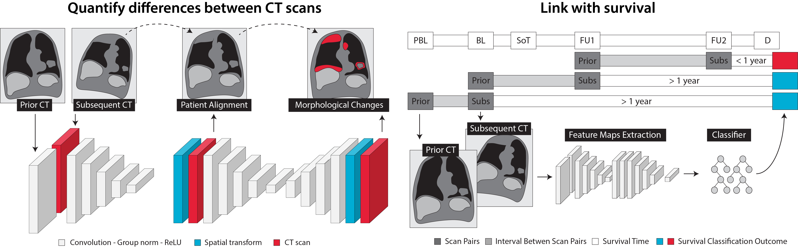

# Prognostic AI-monitoring

This repository contains the code of our research on prognostic AI-monitoring: a prototype for automatic response evaluation to treatment of cancer patients with advanced disease based on deep learning image-to-image registration. 

:construction: This research is still in its preliminary phase, further development and validation is warrant before clinical use.  

## Graphical Abstract

## Requirements

- Python 3.6
- Tensorflow 1.15.0
- Keras 
- Scikit-Learn
- Pandas
- SimpleITK 

`VoxelMorph`, `Neuron` and `Frida` are already included in the `libs` folder. 

Parts of `Keras-Group-Normalization` and `Recursive-Cascaded-Networks` are reused in the main code. 

## Installing requirements using Anaconda

- Virtual environment

          $ conda create --name tf-1.15
          $ conda activate tf-1.15

- Installing packages inside the virtual environment

          $ conda install -c anaconda tensorflow-gpu==1.15
          $ conda install -c anaconda scikit-learn
          $ conda install -c anaconda pandas
          $ conda install -c simpleitk simpleitk
          $ conda install -c conda-forge keras
          $ conda install -c conda-forge nibabel
          $ conda install -c conda-forge tqdm
          $ conda install -c anaconda pillow
          $ conda install -c conda-forge matplotlib

## Publications

Stefano Trebeschi, Zuhir Bodalal, Thierry N. Boellaard,  Teresa M. Tareco Bucho, Silvia G. Drago, Ieva Kurilova, Adriana M. Calin-Vainak,  Andrea Delli Pizzi, Mirte Muller, Karlijn Hummelink, Koen J. Hartemink, Thi Dan Linh Nguyen-Kim,  Egbert F. Smit,  Hugo J. Aerts and  Regina G. Beets-Tan; _Prognostic value of deep learning mediated treatment monitoring in lung cancer patients receiving immunotherapy_, Frontiers in Oncology, Cancer Imaging and Imaging directed Interventions, 2021 doi: 10.3389/fonc.2021.609054 [(it's open access!)](https://www.frontiersin.org/articles/10.3389/fonc.2021.609054)

Stefano Trebeschi, Zuhir Bodalal, Nick van Dijk, Thierry N. Boellaard, Paul Apfaltrer, Teresa M. Tareco Bucho, Thi Dan Linh Nguyen-Kim, Michiel S. van der Heijden, Hugo J. W. L. Aerts and Regina G. H. Beets-Tan; _Development of a Prognostic AI-Monitor for Metastatic Urothelial Cancer Patients Receiving Immunotherapy_, Frontiers in Oncology, Genitourinary Oncology, 2021 doi: 10.3389/fonc.2021.637804 [(it's also open access!)](https://www.frontiersin.org/articles/10.3389/fonc.2021.637804)

